# Dynamic-Web-Development
## Final Project

[Web client link](https://websockets-playground-2020.herokuapp.com/)
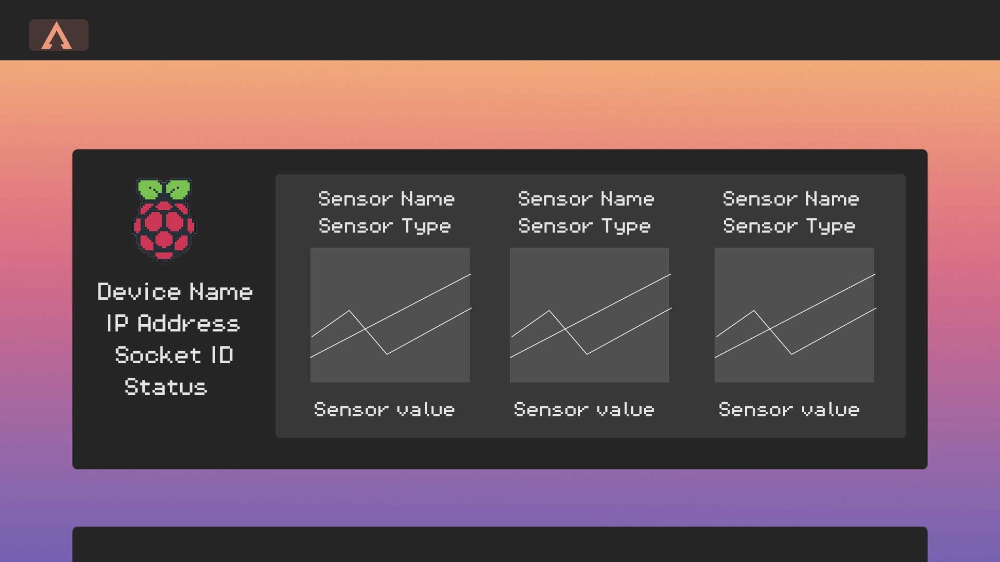

### The Idea


For my final project I have been thinking on how to connect what I have learned in the class and how to work with external inputs from devices like Raspberry Pi and Arduino. I wanted to somehow have my own control panel of connections I have setup, without relying on some hosting service to handle my data. For example, If I am having any one of my Microncontrollers sending any type of data from a sensor, I will be able to see it displayed in my webpage. This way, I can create a boilerplate for myself to store my data in some database online, and also have options of seeing multiple devices at the same time through some kind of personalized UI. Also, If I can input this data into my site I might be able to connect it to any other input or output, video stream, etc... I have two PIs and two arduinos laying around, so I might as well put them to use now.

I would start with documenting MongoDB's limits, to see if I need some other service that allows seamless updating. After the data can be fetched, I would grab the data stream and implement it into the UI. I would make an object for each of my sensors to send to my database, with a key/value pair which would correspond to :


```
    {
        "IP Address": "",
        "Device Type": "",
        "Timestamp":"",
        "Sensor_1": "SensorData"
        "Sensor_1_value":"",

    }
```

So, the system setup in this project would work like this:

1. RaspberryPI(any client really) -----> Server------>WebClient 
2. Server ------->MongoDB as a backup for data.

I think of it as a stepping stone towards my future "utility control monitor". I also want to make web interfaces to control things inside of other software with websockets functionality like Unity, Touchdesigner, and Runway.


### Current Status 

So, everything kind of got tangled up. I set up a lot of individual parts and when joining them together they don't seem to function as well. 

1.  My sockets work with heroku, that's good, this means my heroku server/app are both remotely communicating with my raspberry pi and my web client. However, I am not getting through any messages from my pi to the heroku server. I suspect this is because the 'socket.io-client' package has a different method for emitting messages. I am in the process of finding out why.
   
2.   I know the MongoDB setup works, and it's in the code lying dormant. It's just a matter of changing the data to send to the one I have received by the pi and/or any other device or socket. 

3.   The css and client.js are not getting served correctly, so the js code is the html `<script>` tag and my css is invisible.

***

## Setup


 - This project runs on Node.js and npm. To set up the project you must have these installed and running. You can find more detailed instructions below.
 - This project also has a database currently setup in MongoDB.
  

### Prerequisites

 - Stable internet connection


### Installation

  1. Download this repository to your computer.
  2. Open your terminal in the repository folder.
  3. Make sure you have git, npm, and node.js installed. You can check this with the following commands:
   `git -v`
   `npm - v` 
   `node -v`
  4. If npm and/or node.js are not installed, you may follow this easy to follow guide from Tania Rascia. [How to Install and Use Node.js and npm (Mac, Windows, Linux)](https://www.taniarascia.com/how-to-install-and-use-node-js-and-npm-mac-and-windows/)
  5. Create a MongoDB Database and a Collection in the MongoDB Atlas Platform. More details of how to do this below.  
  6. Once everything is installed, type in the following command while in the repository folder:
  `npm start`
  6. Open your preferred browser and in the address bar type in `http://localhost:3000/`


### Develop

To develop this document, you can follow the steps provided below:

1. Create a fork of this project on Github.
2. Ping the author of this repo via Github Issues to see if they are looking for contributions with the specific feature you're looking to add.
3. Open the file in VS Code and make updates.
4. Add and commit those changes in your forked Github repo.
5. Make a pull request specifying what additions and changes were made.
6. Have a nice chat and open communication with me about those changes. 
7. Celebrate the contribution! 

## Built with
***
* [VS Code](https://code.visualstudio.com/)
* [Github](https://github.com)
* [Node.js](https://nodejs.org)
* [npm](npmjs.com)
* [MongoDB Atlas](https://www.mongodb.com/cloud/atlas)
* [Postman](https://www.postman.com/)
* [Socket.io](https://socket.io/)
* [Heroku](https://www.heroku.com)

***
## Author

* [Alvaro Lacouture](https://alvarolacouture.com) 

***
## Acknowledgements

* [Joey Lee](https://jk-lee.com) -- adjunct professor -- [NYU ITP](https://itp.nyu.edu)
* [Cassie Tarakajian](https://cassietarakajian.com/) -- adjunct professor -- [NYU ITP](https://itp.nyu.edu)
* [The Good Project Readme Project](https://github.com/itp-dwd/2020-spring/blob/master/templates/readme-template.md)

***
## Notes & Process

### Process & Documentation

#### UI

##### Inspiration

I love the pixel art aesthetic, and I wanted a clean UI. I bumped into [Jake Rossilli's](www.jakerosilli.com) work, specifically his 8 bit climate series. You can see some of them below. I really recently discovered I enjoy working with gradients, so it seemed like a good mix.

Jake Rossilli's 8bit climate series UI:

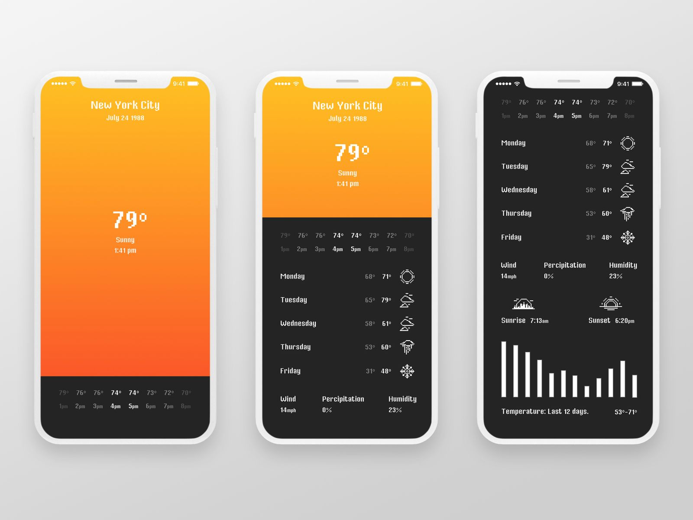

In different color combinations:

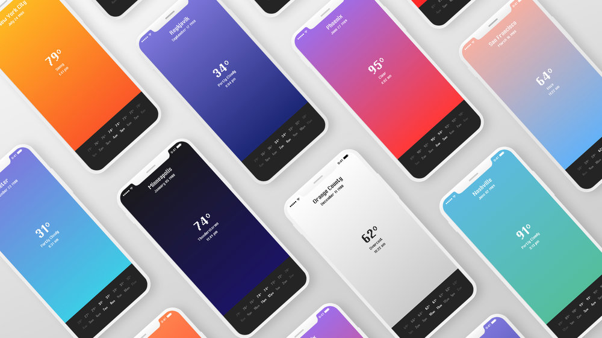


##### My approach

Still in progress. I am using a font called `Pixel Operator`. My logo is on the tio left corner.


#### MongoDB Database Setup

1. First we have to make an account in [MongoDB Atlas](https://www.mongodb.com/cloud/atlas). 

2. After that is done, we have to create a cluster. There should be something like the screen below in the "Clusters" Menu of our project. Here we press "Build a Cluster".

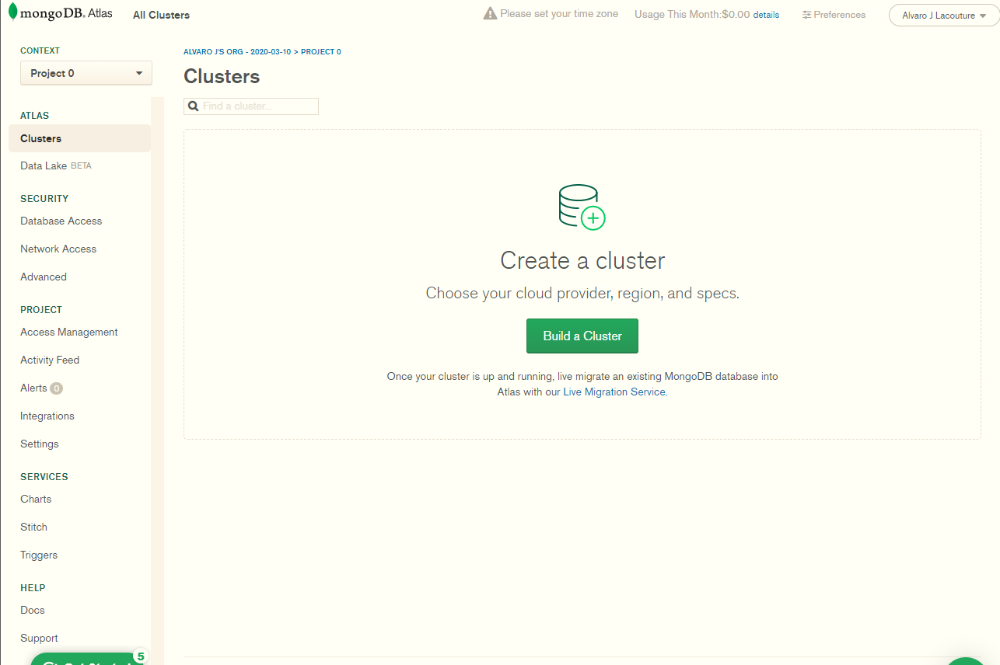

3. Select create a cluster.

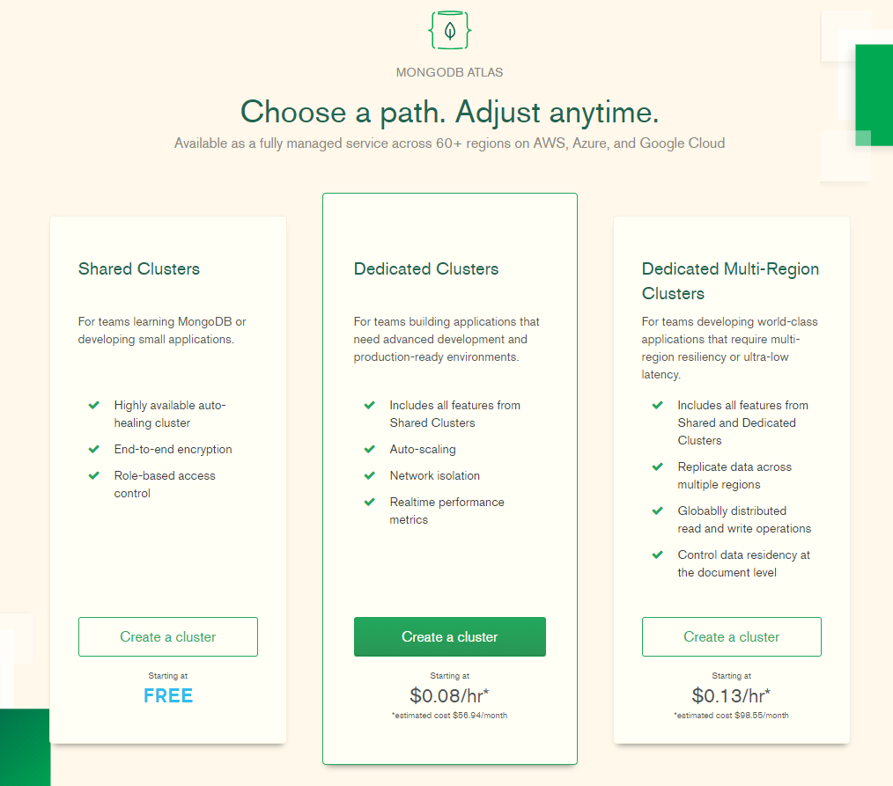

4. Select a Cloud Provider and Region. And then press "Create Cluster".

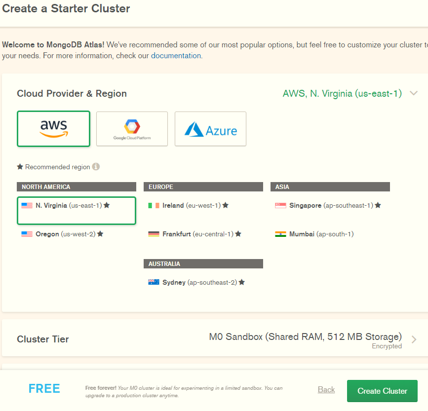

5. Wait for some time while it is created.

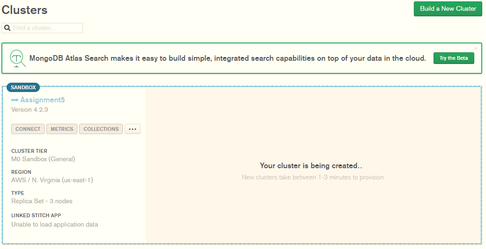

6. Voila! A cluster is born. Here is where our data will live.
   
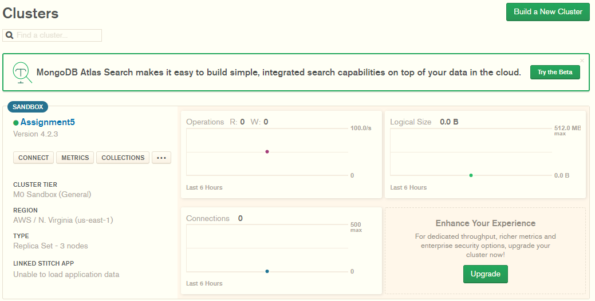

1. On "Whitelist a connection IP address" we put 0.0.0.0 to have open access from anywhere. Also, we create a user and password.

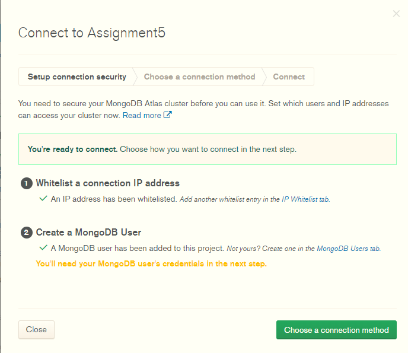

8. Finally, Connect your application will give us a link which we will add to our `.env` file in our server. 

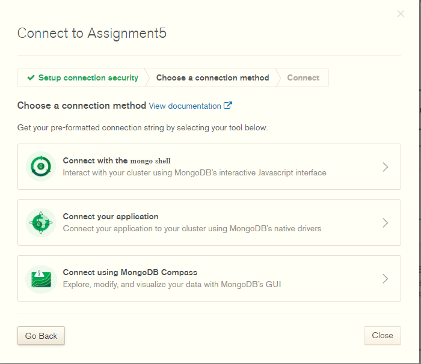


---

#### Heroku Setup

1. Go into the Heroku website and make a new account. Then, in your main dashboard you should see a Createnew app option. 

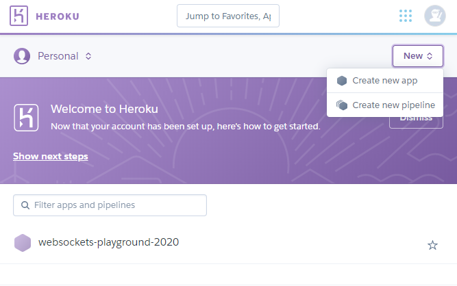

2. Choose a name and a region for your app. This name can be changed later.

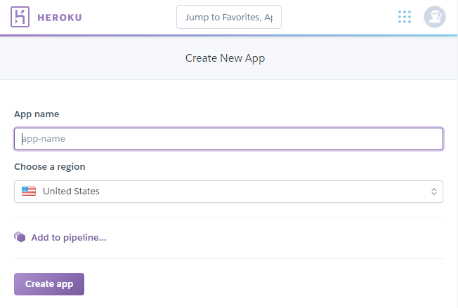

3. You should see a dashboard like the one below. Since we are going to connect Heroku to our existing Git repository, choose the GitHub option in the Deployment Method.

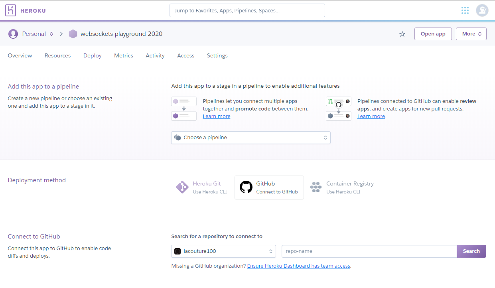

4. Copy the link to our repository into the submit form. Make sure the Github oraganization is correct.

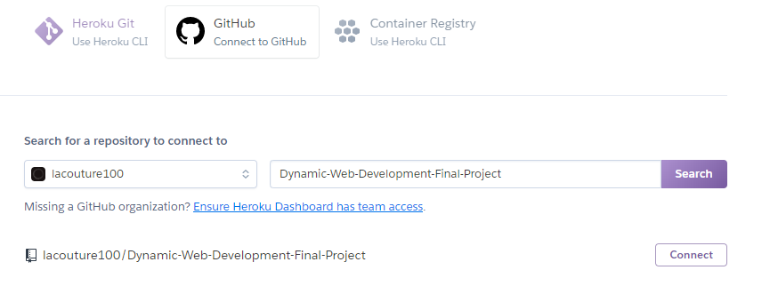

5. Enable Automatic Deployment, this way every time you update your Github Repository so will your Heroku website.

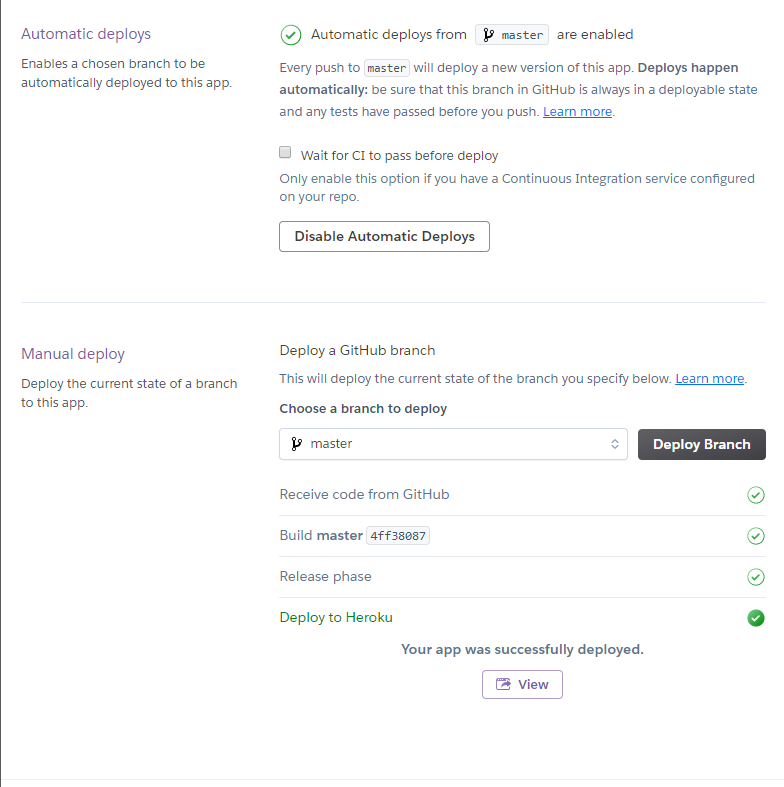

6. To open your app go to the main dashboard and press 'Open app' on the upper right corner.
   
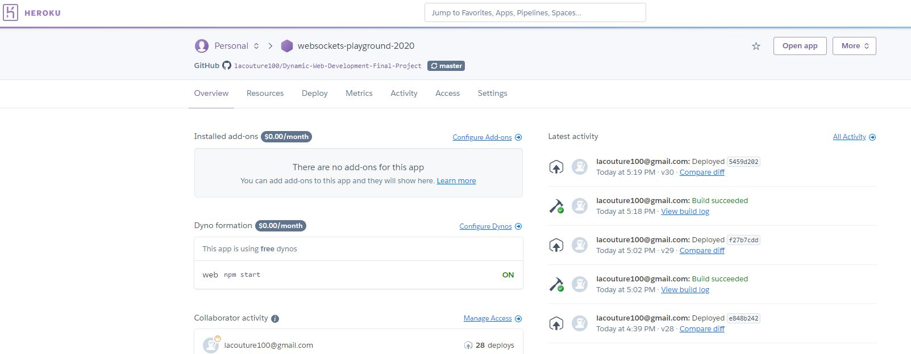

Now, in order to work with Heroku in our commandline we need to do two things:

1. Download the Heroku CLI. In Windows you can download it [here.](https://devcenter.heroku.com/articles/heroku-cli)

2. Download or update your git. In Windows you can download it [here.](https://git-scm.com/download/win)

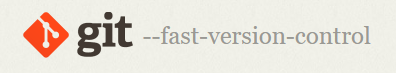

While logged in into you account in the Heroku Website, use the `heroku login` inside of the repository folder assigned earlier. This should connect Heroku to the Github repo.

---

#### Setting up Socket.io

When you start looking around reliable realtime communication through the web, it is inevitable to run into Socket.io. After looking through several different resources, included [this blog post](https://davidwalsh.name/websocket), I decided to go for socket.io since 'The WebSocket API is the future of asynchronous messaging; Socket.IO is the best available resource for WebSocket in Node.js and within the browser.'. You can find the website for Socket.io [here.](https://socket.io/) We'll install it with `npm`. To use the code below I followed a page Joey sent me about [setting up websockets with Heroku](https://devcenter.heroku.com/articles/node-websockets).

##### Server Side

When we talk about sockets, we are using using a server which has a series of clients connected to it. Each client connects through an individual socket or TCP connection, which means that the server opens a socket, the client then connects to the server,which has a callback associated to each event that occurs. In this case, we will create en event called 'event' and send a message associated with that event every five seconds to each of our clients.

```

//Install dependencies
const express = require('express');
const socketIO = require('socket.io');
const INDEX = 'views/index.html'; // Define the index.html file address
const PORT = process.env.PORT || 3000;

const server = express()
  .use((req, res) => res.sendFile(INDEX, {
    root: __dirname
  }))
  .listen(PORT, () => console.log(`Listening on ${PORT}`));

/*The Socket.io server takes an HTTP server as 
an argument so that it can listen for socket.io-related requests*/
const io = socketIO(server);

//Callback event for EACH client
io.on('connection', (socket) => {
  console.log(`Client connected in socket ${socket.id}.`)
});  

let message = "Hello";
//Send a message to every client every five seconds
setInterval(() => io.emit('event', message, 5000));

```
I had to establish an array with current connected users. Everytime the user disconnects the user is removed from the array and consequently, removed from the series of devices being displayed on the website.

##### Client Side

 Install `socket.io-client` with our terminal. The code below is enough for our client to receive and print a message form the server.

 ```
  const socket = io();

        socket.on('event', function (message) {
            //receive the server's message
console.log(message)
        });
        
 ```

---

### Raspberry pi

---


#### Pi Setup 

If you have never setup a Raspberry Pi before, I would recommend following Tom Igoe's [Setting up a Raspberry Pi](https://itp.nyu.edu/networks/tutorials/setting-up-a-raspberry-pi/) of which I did a walkthrough blog post [here.](https://alvarolacouture.com/nyu-itp/assignment-3-web-connected-environmental-monitor/)


##### Socket.io setup

You can find the repository for Socket.io [here.](https://socket.io/) We'll install it with `npm` with the `npm install socket.io-client` command in terminal.

The code below is enough for the pi to connect to our Heroku server. The idea is to send sensor data like temperature or humidity. You can see the code for working with sensors and the raspberry Pi with this [Pi Environmental sensor](https://alvarolacouture.com/nyu-itp/assignment-3-web-connected-environmental-monitor/) I made.

```

var io = require('socket.io-client');

//Connect to the Heroku app
var socket = io.connect('https://websockets-playground-2020.herokuapp.com/', {
    reconnect: true,
    transports: ['websocket'],
    path: '/socket.io'
});

console.log("Pi is on")
socket.on('connect', function (socket) {
    console.log('Connected!');
});

socket.on('event', function (message) {
    console.log(`Message from server: ${message}`);
});

```

Once you run the script you should see something like the image below. In the image below I decided to send the time as the `message` value.

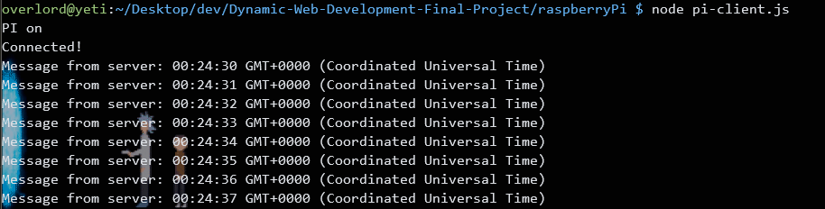

#### Getting it all together

Now, joining it all together. This is where I am at right now. The server is receiving messages from our web client pretty easily. Each socket connection is assigned a random value so I decided to log it's id and any message. This is made with the `socket.emit()` function.  I made a console log to see what the message is as you can see below.

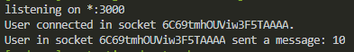

In our client I decided to add every client to the HTML file. I am in that process of making one object for each device connected to the server.

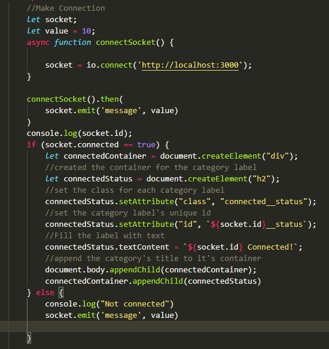

However, you can see the HTML is registering websockets connection in real time (pay attention to the timelog). 

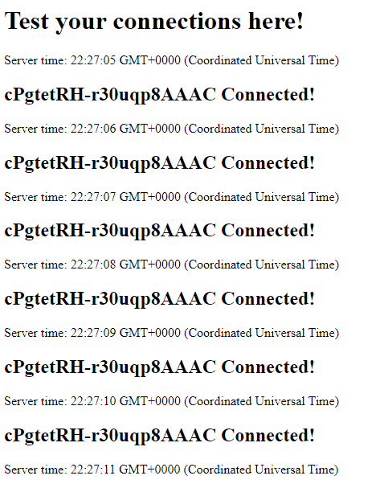


---

## Challenges & Struggles

- Don't know why I have trouble with my CSS and/or client.js getting served. This is mostly frustrating when I could not see any error message, and the error appears as if it is in `client.js`, but the console shows an error in the html file. 
- 


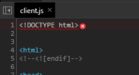

- I did not know what should I put as the host for a websocket out of a local network. This opens up possibilities enormously. Thanks to August Luhrs and Cezar Mocan for helping me understand that. I also found some useful information in this StackOverflow post: 
[How to connect to a remote server](https://stackoverflow.com/questions/40869390/how-to-make-remote-websocket-connection-to-nodejs-server-on-heroku)


## Questions


## References

1. I saw this tool called [Alooma Live](https://www.alooma.com/getlive), for working with data streams. [Here is how it looks in action](https://www.alooma.com/live).

